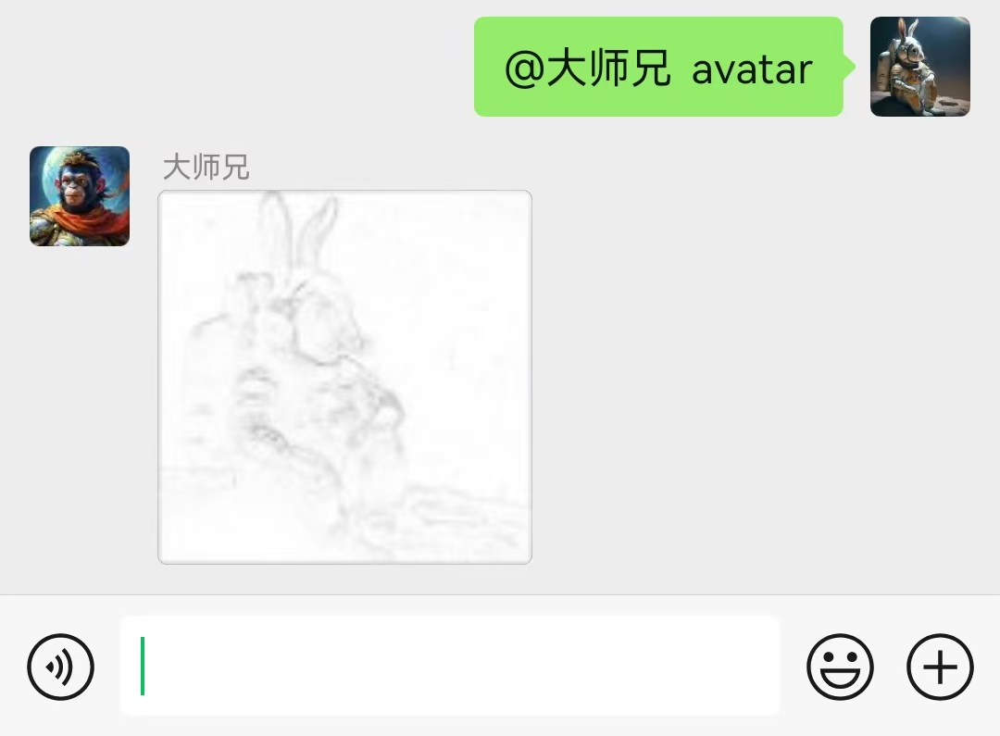

# plugin_avatar
## 简介
一个极简的概念验证demo([chatgpt-on-wechat](https://github.com/zhayujie/chatgpt-on-wechat)插件)，在微信群或1V1给机器人发送特定消息，即可立即获得自己的新头像（这里演示的是提取头像图片中的轮廓信息）。
适用于类似给微信头像加国旗、圣诞帽之类的玩法。

## 安装
- clone或下载本仓库源代码到[chatgpt-on-wechat](https://github.com/zhayujie/chatgpt-on-wechat)的plugins文件夹中
- 启动chatgpt-on-wechat，即可自动加载并启用本插件

## 其他
- 依赖itchat，新注册的账号需要做实名认证。
- 任何想法、建议、需求、问题等，欢迎加微信交流：fred2025，备注avatar。

